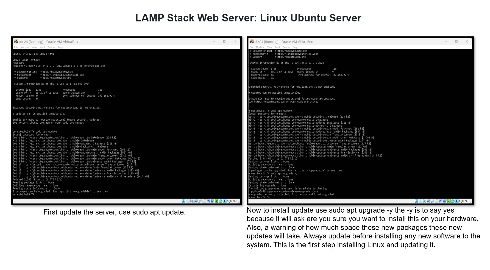
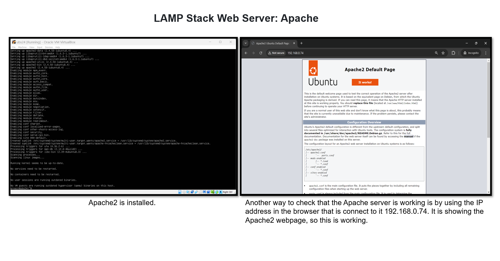
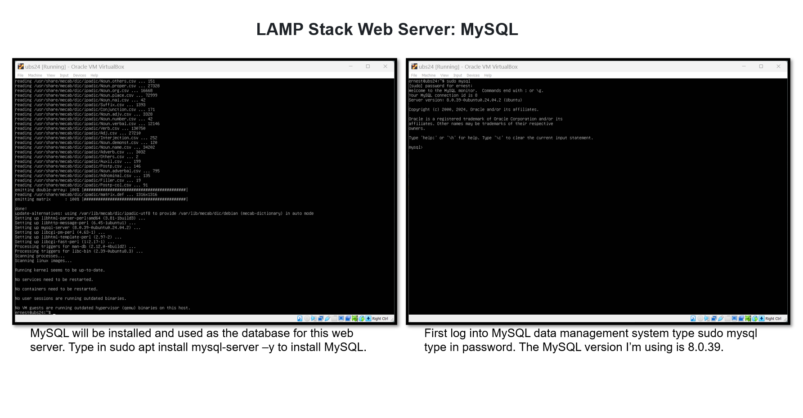
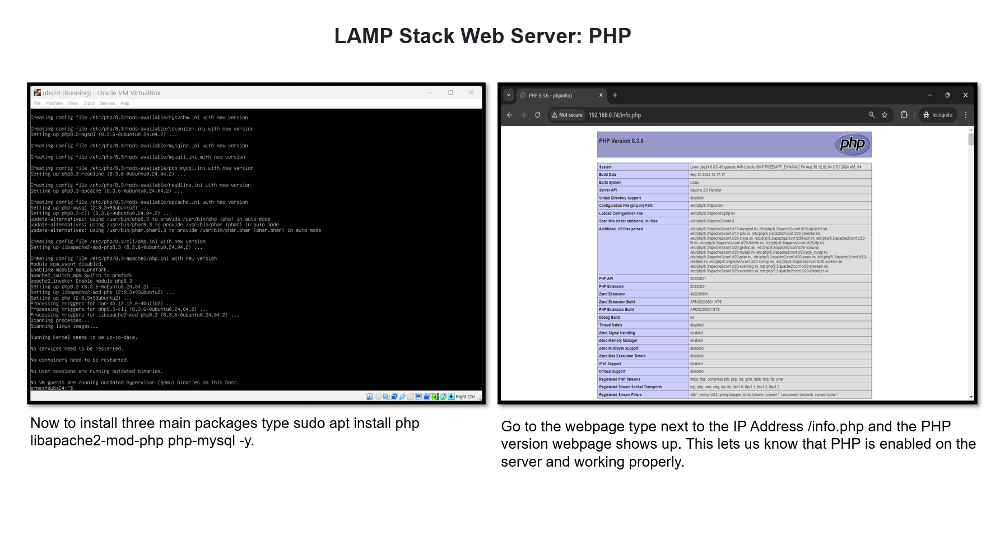

# LAMP-Stack-WebServer-Lab
## LAMP Stack Web Server Lab
 
### Lab:
<li>Used Ubuntu Server to set up a static IP address, to run  the web server
<li>Installed and set up, Apache2, MySQL and PHP
<li>Tested connectivity of Apache2, MySQL and PHP
<li>Set up webpages. Test connectivity between MySQL and PHP

For the full pdf version of this lab click on the link below, when viewing keep pressing more pages button or if the more pages button disappears press the git hub logo that is loading. 

[Your Link Here](https://github.com/EA-IT2/LAMP-Stack-WebServer-Lab/blob/main/LAMP%20stack%20Web%20Server%20lab.pdf)

### Software used:
Virtual Box: Linux, Ubuntu Server: Operating System, Apache2, MySQL, PHP 

